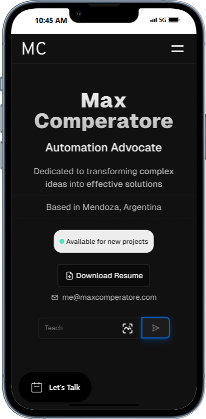
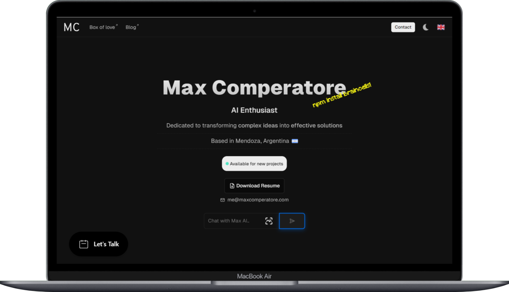
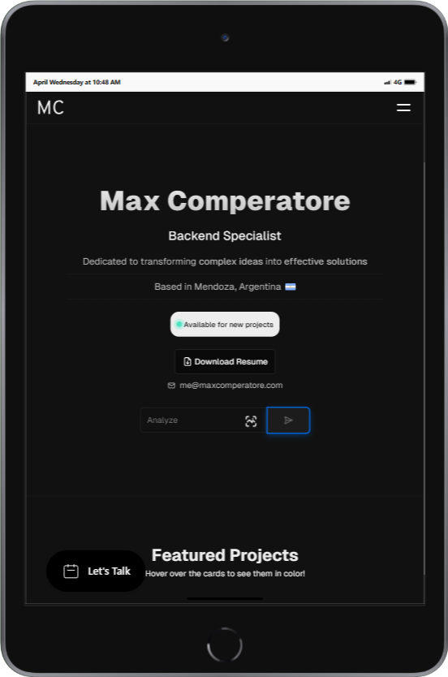

# Max Comperatore's Portfolio

This project is a fork of the [original portfolio](https://github.com/dresandev/dresan.dev) by [Dresan](https://dresan.dev).  
Permission to use and modify the source code was granted by the original author on July 16, 2024.

It includes several improvements and customizations to meet specific needs.

Based on the [Geist Design System](https://vercel.com/geist/introduction) by [Vercel](https://vercel.com).


[](https://app.codacy.com/gh/pyoneerC/maxcomperatore.com/dashboard?utm_source=gh&utm_medium=referral&utm_content=&utm_campaign=Badge_grade)

## Table of Contents

- [Project Structure](#project-structure)
- [Installation](#installation)
- [Usage](#usage)
- [Features](#features)
- [Contact](#contact)


---

---


## Project Structure

```
.
├── public
│   ├── assets
│       ├── cursor
│       ├── files
│       └── styles
├── src
│   ├── components
│   ├── actions
│   ├── app
│   ├── helpers
│   ├── hooks
│   ├── styles
│   ├── utils
│   ├── data
│   └── styles
├── package.json
└── tsconfig.json
```

## Project Structure

- **public**: Contains the static files used in the project.
- **src**: Contains the project's source code.
- **components**: Contains the React components used in the project.
- **helpers**: Contains helper functions used throughout the project.
- **hooks**: Contains custom hooks used across the project.
- **styles**: Contains global styles used in the project.
- **utils**: Contains utility functions used throughout the project.
- **data**: Contains the data used throughout the project.

> [!NOTE]
> This project uses NEXT.js, TypeScript, and CSS.

## Installation

To install the project dependencies, run:

```bash
npm install
```

## Usage

To start the development server, run:

```bash
npm start
```

To build the project for production, run:

```bash
npm run build
```

## Features

- **Modular Design**: The project is organized into components, actions, helpers, hooks, styles, and utils.
- **Tag Management**: A list of tags used throughout the project for categorization and filtering.
- **Responsive Design**: Ensures the application looks good on all devices.
- **Custom Cursor**: A custom cursor that changes based on user interaction.
- **Back to Top Button**: A button that scrolls the user back to the top of the page.
- And much more...

## Contact

For any inquiries, please contact [me@maxcomperatore.com](mailto:me@maxcomperatore.com).

Made with ❤️ by Max Comperatore.